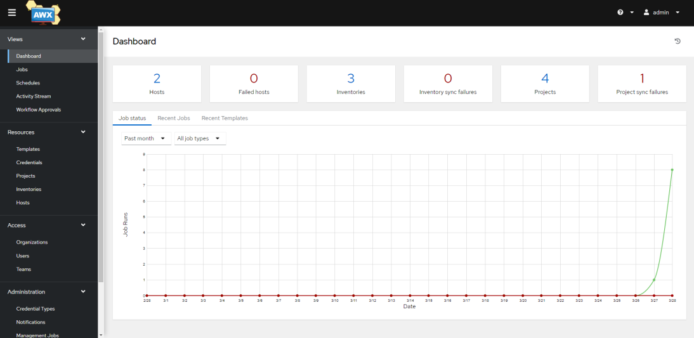

# Taller - Introducción a Ansible Tower / AWX

## Tabla de contenidos

* [Objetivos](#Objetivos)
* [Guía](#Guía)
* [¿Por qué Ansible Tower?](#Por-qué-Ansible-Tower)
* [Su entorno de laboratorio de Tower Ansible](#Su-entorno-de-laboratorio-de-Tower-Ansible)
* [Tablero de control](#tablero-de-control)
* [Conceptos](#Conceptos)

# Objetivos

Este ejercicio proporciona una visión general de Ansible Tower/AWX que consiste en repasar las funciones proporcionadas por Tower. Se cubren elementos como:
  - Job Templates / Plantillas de trabajo
  - Proyectos / Projects
  - Inventarios / Inventories
  - Credenciales / Credentials
  - Flujos de trabajo / Workflows

# Guía

## ¿Por qué Ansible Tower?

Ansible Tower es una interfaz de usuario basada en web que proporciona una solución empresarial para la automatización de TI:

  - tiene un panel fácil de usar

  - complementa Ansible, añadiendo automatización, gestión visual y capacidades de monitorización.

  - proporciona control de acceso de usuario a los administradores.

  - gestiona o sincroniza gráficamente los inventarios con una amplia variedad de fuentes.

  - tiene una API RESTful

  - Y mucho más...

## Su entorno de laboratorio de Tower Ansible

En este laboratorio se trabaja con un entorno preconfigurado. Tendrás acceso a los siguientes hosts:

| Role                         | Inventory name |
| -----------------------------| ---------------------------|
| Ansible Control Host & Tower | awx.devsecops.local        |
| Managed Host 1               | nodo1.devsecops.local      |
| Managed Host 2               | nodo2.devsecops.local      |
| Managed Host 2               | nodo3.devsecops.local      |

Se ha provisionado un único servidor de Ansible AWX para realizar los ejercicios.

## Dashboard

Echemos un primer vistazo a AWX: Acceder mediante navegador a la url `https://awx.devsecops.local` e iniciar sesión con el usuario `academia`. Consultar la contraseña.

La GUI de Ansible AWX da la bienvenida con un panel que muestra:

  - actividad trabajo reciente

  - el número de hosts gestionados

  - punteros rápidos a listas de hosts con problemas.

El panel también muestra datos en tiempo real sobre la ejecución de tareas completadas en los playbooks.

## Conceptos

Antes de profundizar en el uso de Ansible Tower para  automatización, debe familiarizarse con algunos conceptos y convenciones de nomenclatura.

**Proyectos**

Los proyectos son colecciones lógicas de playbooks de ansibles en Ansible Tower. Estos playbooks pueden residir en la instancia de Ansible Tower o en un sistema de control de versiones de código fuente compatible con Tower.

**Inventarios**

Un inventario es una colección de hosts en los que se pueden iniciar trabajos, lo mismo que un archivo de inventario de Ansible. Los inventarios se dividen en grupos y estos grupos contienen los hosts reales. Los grupos se pueden rellenar manualmente, introduciendo nombres de host en Tower, desde uno de los proveedores de nube compatibles con Ansible Tower o a través de scripts de inventario dinámicos.

**Credenciales**

Tower utiliza las credenciales para la autenticación al ejecutar trabajos en las maquinas, sincronizar con fuentes de inventario e importar contenido de proyecto desde un sistema de control de versiones. La configuración de credenciales se puede encontrar en Configuración.

Las credenciales usadas por Tower se importan y almacenan cifradas y ningún usuario puede recuperarlas en texto sin formato en la línea de comandos. Puede conceder a los usuarios y equipos la capacidad de usar estas credenciales, sin exponer realmente la credencial al usuario.

**Job Templates**

Un `job template` es una definición y un conjunto de parámetros para ejecutar un trabajo de Ansible. Relaciona proyectos, inventarios y credenciales. Son útiles para ejecutar el mismo trabajo muchas veces. Los job Templates  fomentan la reutilización del contenido del playbook de Ansible y la colaboración entre equipos. Para ejecutar un trabajo, Tower requiere que primero cree una plantilla de trabajo.

**Trabajos**

Un trabajo es básicamente una instancia en la que Tower lanza un playbook de Ansible contra un inventario de hosts.

----
**Navegación**
 
[Ejercicio anterior](../1.7-role/README.es.md) - [Próximo Ejercicio](../2.2-cred/README.es.md)

